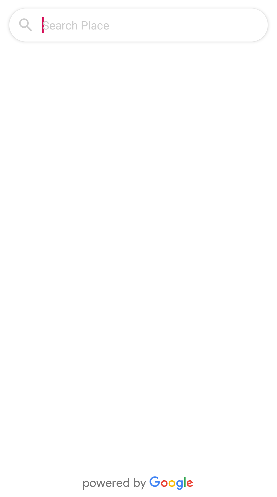
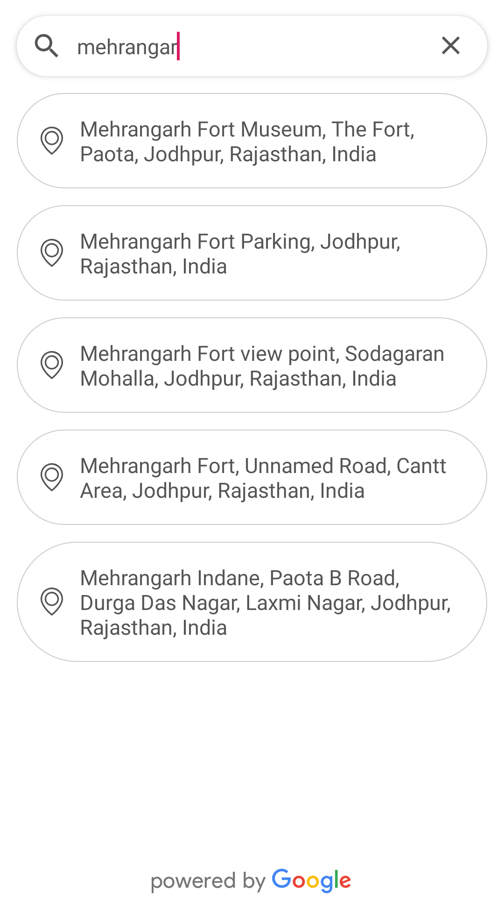
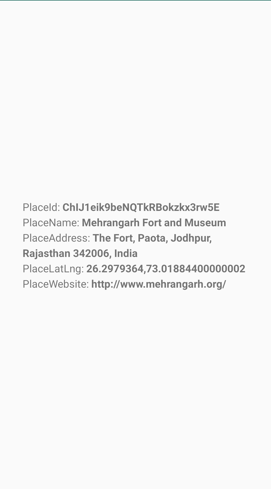

## AndroidX Compatible

#Screenshots





# MyPlaces

An android library which contains the google's place autocomplete API implementation, along with some UI and customization options.

# Installation

In your project level build.gradle file:

```
allprojects {
    repositories {
        google()
        jcenter()
        maven { url 'https://jitpack.io' }
    }
}
```

Then in your app level build.gradle file:

```
android {
	dataBinding {
	   enabled = true
	}
}

dependencies {
	implementation 'com.github.SachinRupani:MyPlaces:1.0.1-alpha'
}

```

# Implementation

Now to use the library in your app, write the following code in your activity:

## Basic

```
MyPlaces.with("AIzaXXXXXXXXXXXXXXXXXXXXXX") //Your Google API key
            .startSearch(this)
```

## Customization

```
MyPlaces.with("AIzaXXXXXXXXXXXXXXXXXXXXXX") //Your Google API key
            //.setTextTypeFace(Typeface.createFromAsset(assets, "Ubuntu-Medium.ttf")) //For changing the font typeface of search box and list items
            //.setLocationIcon(R.drawable.ic_location) //For changing the default location icon
            //.setNearbyLocation(lat = 28.7041, lng = 77.1025) //For getting results according to a specific lat lng
            //.setCountry("in") //For country specific results, refer to country codes
            //.setBackgroundListItem(android.R.color.transparent) //For changing the default list item background resource
            //.animateList(false) //true by default
            .startSearch(this)
```

Then, in your onActivityResult method of your activity:

```
override fun onActivityResult(requestCode: Int, resultCode: Int, data: Intent?) {
        super.onActivityResult(requestCode, resultCode, data)
        if (resultCode == Activity.RESULT_OK && requestCode == MyPlaces.REQUEST_CODE_PLACE_SEARCH) {
            val placeResult = data?.extras?.getSerializable(MyPlaces.MY_PLACE_RESULT) as PlaceModel?
            
            //Now with this placeResult, you can access its placeId, name, address, lat, lng etc
            
            //placeResult?.placeName
            //placeResult?.placeAddress
            
            /*Log.d("Place", "PlaceId: ${placeResult?.placeId}"
                        + "\nPlaceName: ${placeResult?.placeName}"
                        + "\nPlaceAddress: ${placeResult?.placeAddress}"
                        + "\nPlaceLatLng: ${placeResult?.placeLat},${placeResult?.placeLng}"
                        + "\nPlacePhone: ${placeResult?.placePhoneNo}"
                        + "\nPlaceWebsite: ${placeResult?.placeWebsite}"
                        + "\nPlaceRating: ${placeResult?.placeRating}"
            )*/
        }
    }
```

That's it, Happy Coding